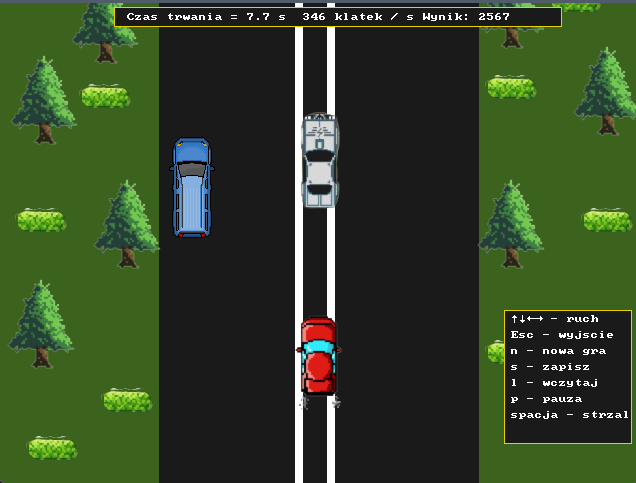

# Spy Hunters

    

## Description
Spy Hunters is a C++ game that simulates a high-speed car race using the SDL2 library for graphics. The game involves avoiding collisions with enemy and civilian cars while navigating through a dynamically generated road environment. The player can shoot projectiles to destroy enemy cars and score points by traveling as far as possible without crashing. The game features saving and loading functionality to allow players to continue their progress.

## Features
- **Dynamic Road Environment**: The road and surroundings are dynamically generated, including trees and bushes.
- **Car Controls**: Use arrow keys to move the car up, down, left, and right.
- **Projectile Shooting**: Press the space bar to shoot projectiles at enemy cars.
- **Enemy and Civilian Cars**: Avoid collisions with enemy and civilian cars that move independently.
- **Score System**: Gain points for distance traveled without crashing.
- **Save and Load**: Save the current game state to a file and load it back later to continue playing.
- **Pause Functionality**: Pause the game with the 'p' key.
- **Information Display**: Shows game time, FPS, and score on the screen.

## How to Play
1. **Start the Game**: Run the program to start the game.
2. **Control the Car**: Use the arrow keys to navigate your car:
   - Up Arrow: Move up
   - Down Arrow: Move down
   - Left Arrow: Move left
   - Right Arrow: Move right
3. **Shoot Projectiles**: Press the space bar to shoot projectiles.
4. **Game Commands**:
   - `n`: Start a new game.
   - `s`: Save the current game.
   - `l`: Load a saved game.
   - `p`: Pause or unpause the game.
   - `Esc`: Quit the game.
5. **Avoid Collisions**: Steer clear of enemy and civilian cars to avoid losing points or ending the game.
